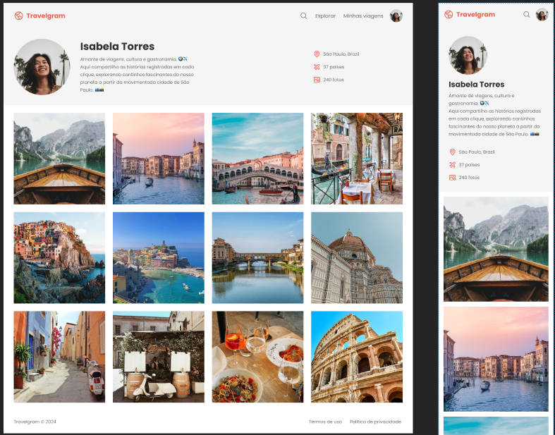

<h1 align="center"> Travelgram v2.0</h1>

  Projeto desenvolvido com os conhecimentos adquiridos no módulo de responsividade do curso da Rocketseat.  
  <strong>Neste projeto adaptei a página utilizando Media Queries para desktop e mobile</strong>

  <a href="#-tecnologias">Tecnologias</a>&nbsp;&nbsp;&nbsp;|&nbsp;&nbsp;&nbsp;
  <a href="#-projeto">Projeto</a>&nbsp;&nbsp;&nbsp;

 

  

## 🚀 Tecnologias

Esse projeto foi desenvolvido com as seguintes tecnologias:

- HTML e CSS
- Git e Github
- Figma

## 💻 Projeto

Esta página traz um perfil de uma viajante Isabela Torres, onde compartilha fotos de suas últimas viagens pelo mundo.🌍

---

Feito com ♥ by May
